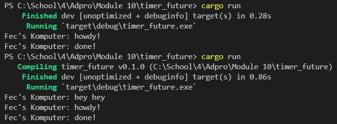
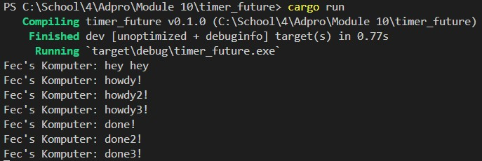

## Reflection

Based on the observation, the async function will execute outside the main function that calls it. Hence, *"hey hey"* might be outputted before *"howdy!"* and *"done!"* since *"hey hey"* is outside the async function. 

The program continues and executes `println!("hey hey")`; while the async function is still waiting for future's result.

From the resulting output, it is shown that having many spawners leads to even more tasks being performed because more tasks are queued into the task sender, which acts like a message queue. 

Not dropping spawners causes the program to never stop because it assumes that there will be data transmission by the spawner. Dropping the spawner itself indicates that the interaction is finished and the spawner will be closed. 

When a spawner calls the spawn function, a new task is created and sent to the task sender. The executor takes one task from the task sender and executes it, then takes another task until all tasks are completed and the spawner is dropped, indicating the interaction is complete.